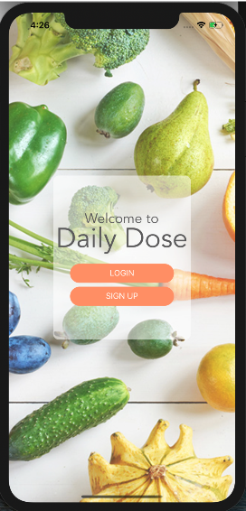
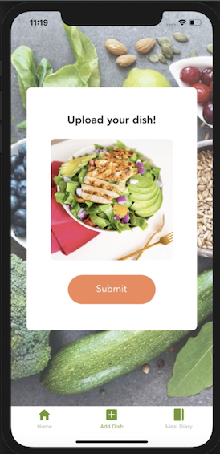
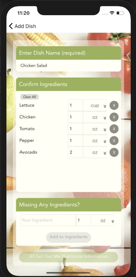
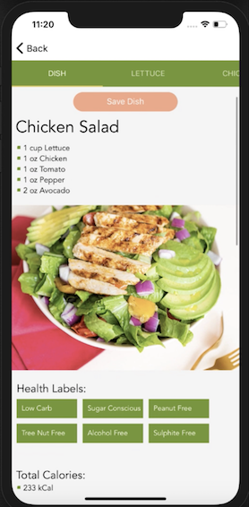
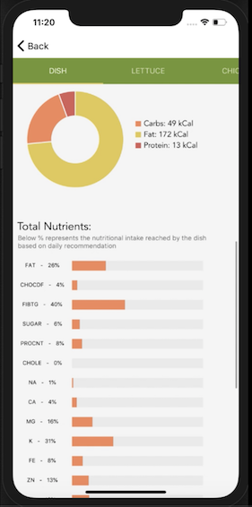
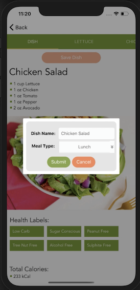
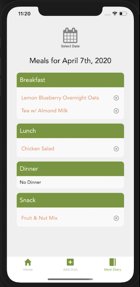

# Daily Dose

​Daily Dose is a mobile application that uses visual recognition to process food images and analyze nutritious intake. It provides a historical log of diet enabling you to make healthy choices.

## How to Use Daily Dose

1. Create an account
2. Snap a photo of your food or upload an existing food image
3. Confirm ingredient list and customize quantity and measurements
4. View nutritional data for dish and each ingredient
5. Save meal to meal diary
6. Review meal diary to review data on previous meals, remove previous meals, or easily add saved meals to current day’s log
   ​

### Installation

What things you need to install the software and how to install them

- Node.JS
- NPM
- Expo IO
- Xcode (to view using the simulator on computer)

Viewing Daily-Dose:
Clone this repo and install all dependencies (‘npm install’) and then run it with the script ‘npm start’. To view the app on your phone (iOs only), first install the Expo IO app on your iOs mobile device and then scan the QR code provided below. You can also view this app on your computer using the xcode Simulator.

Scan QR Code:

1. Npm install all dependencies
2. Npm start
3. Download Expo IO on iOs mobile phone and scan QR code to view Daily-Dose on your phone

## Built With

Tech Stack

- [React-Native](https://reactnative.dev/) built with [Expo](https://expo.io/)
- [Redux](https://redux.js.org/)
- [Express.JS](https://expressjs.com/)
- [Sequelize](https://sequelize.org/)
- [PostgreSQL](https://www.postgresql.org/)

API

- [Clarifai](https://www.clarifai.com/models/food-image-recognition-model-bd367be194cf45149e75f01d59f77ba7)
- [Edamam](https://www.edamam.com/)

React-Native/Expo Libraries

- [React-Native-SVG-Charts](https://www.npmjs.com/package/react-native-svg-charts)
- [React-Native-SVG](https://www.npmjs.com/package/react-native-svg)
- [D3-Shape](https://www.npmjs.com/package/d3-shape)
- [React-Native-Tab-View](https://www.npmjs.com/package/react-native-tab-view?activeTab=readme)
- [React-Native-Elements](https://www.npmjs.com/package/react-native-elements)
- [React-Native-Check-Box](https://www.npmjs.com/package/react-native-check-box)
- [Formik](https://www.npmjs.com/package/formik)
- [React-Native-DateTimePicker](https://www.npmjs.com/package/@react-native-community/datetimepicker)
- [Moment](https://www.npmjs.com/package/moment)
- [Expo-Camera](https://www.npmjs.com/package/expo-camera)
- [Expo-Image-Picker](https://www.npmjs.com/package/expo-image-picker)

# Gallery

## Authors

- [Emma Fox](https://github.com/fox-emma)
- [Sooin Chung](https://github.com/sooinc)
- [Jane An](https://github.com/janeyuhwian)
- [Nesara Kishor](https://github.com/nesarazui)

## License

This project is licensed under the MIT License - see the [LICENSE.md](LICENSE.md) file for details

## Acknowledgments

- [React-Native-Fab-Pie](https://github.com/giacomocerquone/react-native-fab-pie)
